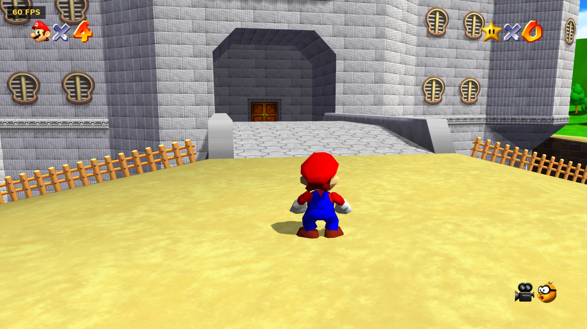
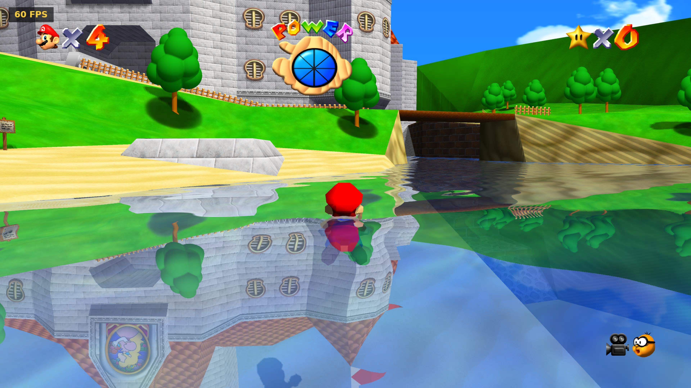
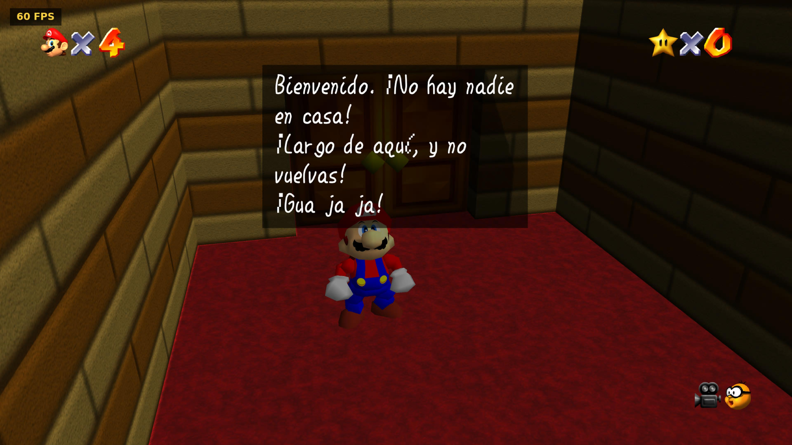

# Super Mario 64 for PS5

A native PlayStation 5 port of the Super Mario 64 decompilation, based on
[sm64-port](https://github.com/sm64-port/sm64-port).
- It installs and launches **as a real title from the home screen**.
- It renders on the **PS5's GPU**, through AGC, the console's native graphics API.
- On top of the original game it adds real-time water reflections, real-time
  shadows, 60 fps, 4K and support for HD texture packs.

It is linked with [ps5link](https://github.com/Rufidj/ps5link-sdk), a linker for native PS5 titles
written in C.

> **No game data is included.** You need your own Super Mario 64 ROM (US
> version). The build takes the assets out of the program and the console
> puts them back from your ROM when the game starts.

> Tested on a jailbroken **PS5 on firmware 9.00**.

---

## What it looks like

[](https://youtu.be/BNDHSYuKUM8)

*Running on the console - click to watch.*

Below, at 4K with the HD texture pack installed.

| | |
|---|---|
|  |  |
| The castle grounds: real shadows, and the frame counter the options menu can show. | The moat, with the world mirrored in the water. |



The game in Spanish, accents and inverted marks included - drawn over the
ROM's own letters, since the US font has none of them.

---

## Features

### Graphics
- **GPU renderer**
  - A rendering backend for the port's display-list interpreter
    (`ps5/gfx_agc.c`), on a small AGC layer of its own (`ps5/ps5gpu.c`).
  - Hand-written GPU programs in AMD GPU assembly.
- **Resolution and antialiasing**
  - Native 4K output, if the TV supports it.
  - Or 1080p with 2×2 supersampling, drawn at 4K and scaled down.
- **16:9 widescreen** or the original **4:3**.
- **60 fps**
  - The game still runs its logic at 30 steps a second.
  - Every other frame is interpolated from `enhancements/60fps.patch`, merged
    into the renderer.
- **Animated water and lava** with their own pixel programs.
- **Planar water reflections**
  - The world and the sky are mirrored in the water surface.
  - A fresnel term blends the reflection in.
  - The strength of the sky's reflection is adjustable.
- **Real-time shadows**
  - A cascaded shadow map (4096×2048, two cascades), so shadows reach far into
    the distance, filtered with PCF.
  - They replace the original round blob shadows.
  - Choose between objects only, or objects and the level.
- **HD texture packs**
  - Supports packs in the sm64ex layout, such as
    [SM64 Reloaded](https://evilgames.eu/texture-packs/sm64-reloaded.htm) by
    GhostlyDark.
  - The pack is detected automatically and can be switched on and off while
    playing.
- **English or Spanish**
  - The whole game: the dialogues, the names of the courses and their stars,
    and the menus, as well as the port's own options menu.
  - Chosen while playing, from the options menu. The first time, it follows the
    console's own language.
  - The US ROM has no accented letters, so they are drawn on top of the game's
    own ones, the way the European versions do it. The inverted question and
    exclamation marks are made on the console from the player's own ROM.
  - The translation is ours: see `ps5/lang/`.
- **The buttons the game names are the DualSense's**
  - Where the game drew the N64's A, B, C and Z, it draws cross, square, the
    right stick and L, matching what the port maps them to. R is left alone: it
    already reads as R1 and R2.
  - Drawn in the same stroke as the letters around them, in both languages.
- **Longer object draw distance**
  - Objects stay visible up to three times farther away.
  - Only drawing is extended: objects still behave exactly as in the original.

### Options menu
Press the **touchpad** to open it. The game pauses while it is open.
- **D-pad**: choose an option and change its value.
- **Circle** or the **touchpad**: close the menu.

Settings are saved.

| Option | Values |
|---|---|
| Language | English, Español |
| Display | 16:9, 4:3 |
| Water reflections | on, off |
| Sky reflection | off, 15%, 35%, 60%, 100% |
| Antialiasing | on, off (1080p only) |
| Resolution | 1080p, 4K (when the TV supports it) |
| 60 FPS | on, off |
| Show FPS | on, off (counter in the top-left corner) |
| HD textures | on, off (greyed out when no pack is installed) |
| Real shadows | off, objects, everything |
| Rumble | on, off |
| Object draw distance | normal, far, very far |

- **Rumble**
  - The game's own rumble, from the Shindou version's code: hard landings,
    ground pounds, damage, bosses, over a hundred cues in all. The US build
    leaves it turned off; this turns it on.
  - The DualSense has no rumble motors, so it is played through the pad's
    vibration channel as sound, one tone in each voice coil.
  - The Rumble Pak had a single speed and pulsed it to suggest strength. Here
    the strength the game asks for becomes the amplitude, so a light bump feels
    different from a heavy landing.
  - Can be switched off in the options menu.

### Everything else
- DualSense controls, sound and saves.
- Save files and settings live in the title's own `data/` folder.

### Controls

| DualSense | N64 |
|---|---|
| Left stick | Control stick |
| Cross | A |
| Square, Circle | B |
| L1, L2 | Z |
| R1, R2 | R |
| Right stick | C buttons (camera) |
| D-pad | D-pad |
| Options | Start |
| Touchpad | Options menu |

---

## Requirements

### On the console
You need the same setup as for any ps5link title. See the
[ps5link SDK README](https://github.com/Rufidj/ps5link-sdk#what-you-need-on-the-console) for details.
- A jailbroken PS5 (tested on FW 9.00 with etaHEN: FTP on port 1337, ELF
  loader on port 9021).
- **[kstuff](https://github.com/EchoStretch/kstuff)** (EchoStretch fork).
  Send it with the ELF loader after the console has fully booted, never from
  an autoload script.
- **[ShadowMountPlus](https://github.com/drakmor/ShadowMountPlus) v1.6beta16**.
  Version 1.7alpha13fix1 does not work. If `/data/shadowmount/config.ini`
  lists any `scanpath=`, add `scanpath=/data/homebrew` to it.

### On the PC
Tested on Linux Mint 22.1 (Ubuntu 24.04 based).
- What the PC build of sm64-port needs:
  ```sh
  sudo apt install -y git build-essential pkg-config python3 libusb-1.0-0-dev libsdl2-dev
  ```
- `python3-pil` and `fonts-dejavu-core`, to render the menu's font.
- `llvm-18`, whose `llvm-mc` and `llvm-objcopy` have the amdgcn target, to
  assemble the GPU programs.
- [ps5-payload-sdk](https://github.com/ps5-payload-dev/sdk), for `prospero-clang`.
- [ps5link SDK](https://github.com/Rufidj/ps5link-sdk), built with `make`.
- [SharpProspero](https://github.com/SvenGDK/SharpProspero) and the .NET 10
  SDK, for signing.
- A signed `libc.prx` that matches your firmware, from one of your own game
  dumps. See the ps5link SDK README; it cannot be distributed.

---

## Building

```sh
git clone <this repository> sm64-ps5
cd sm64-ps5
cp /path/to/your/baserom.us.z64 .       # must match sm64.us.sha1

# 1. The normal PC build. It extracts the assets from the ROM and generates
#    the sources the PS5 build compiles.
make -j$(nproc)

# 2. The PS5 build.
export PS5_PAYLOAD_SDK=/opt/ps5-payload-sdk
export PS5LINK=$HOME/ps5link-sdk
export SHARPPROSPERO=$HOME/SharpProspero
export LIBC_PRX=/path/to/signed/libc.prx
export LLVM_MC=/usr/lib/llvm-18/bin/llvm-mc
export LLVM_OBJCOPY=/usr/lib/llvm-18/bin/llvm-objcopy
export PATH=$HOME/.dotnet:$PATH                # wherever dotnet is
./ps5/build.sh
```

The title is written to `ps5/out/PPSA64064/`. These optional variables change
the build:
- `TITLE_ID` sets another title id (4 capital letters and 5 digits).
- `TITLE_NAME` sets the name shown on the home screen.
- `HD_PACK=/path/to/pack/gfx` matches the HD texture index to the pack you use.

## Installing

1. Copy `ps5/out/PPSA64064/` with FTP to `/data/homebrew/PPSA64064/`.
2. Copy your ROM into it as `data/sm64_ps5/baserom.us.z64`.
3. Optionally, copy an HD texture pack into `data/sm64_ps5/texturas_hd/`.
   Put in the pack's `gfx/` folder, or its contents.
4. Start ShadowMountPlus. The title appears on the home screen.

The finished folder looks like this:

```
PPSA64064/
├── eboot.bin
├── sm64_assets.map          where the ROM's data goes back into the program
├── sm64_hd_textures.idx     texture hash -> HD pack image
├── sce_module/libc.prx
├── sce_sys/param.json, icon0.png
└── data/sm64_ps5/
    ├── baserom.us.z64       your ROM
    ├── texturas_hd/         optional HD pack
    ├── saves/               created by the game
    └── ajustes.txt          settings, created by the game
```

If the screen stays black or the game reports a missing or wrong ROM, check
that the ROM is the US version, is named exactly `baserom.us.z64` and is in
the path above.

---

## How it works

| Part | Where |
|---|---|
| Entry point, main loop, 60 fps frame pacing, save folder | `ps5/main_ps5.c` |
| AGC: video out, render targets (scene, reflection, shadow atlas, 4K), command buffers, flips | `ps5/ps5gpu.c` |
| Rendering backend: batching, projection, water, lava, reflections, shadows, HD texture upload | `ps5/gfx_agc.c` |
| Display-list interpreter, extended to replay the frame for shadows and reflections | `src/pc/gfx/gfx_pc.c` |
| Scene graph: marks the world and sky for reflections and shadows, water plane, draw distance | `src/game/rendering_graph_node.c`, `src/engine/behavior_script.c` |
| GPU programs (AMD GPU assembly) and the container packer | `ps5/shaders_src/`, `ps5/shader_tools/agcpack.py`, `ps5/build_shaders.sh` |
| Options menu and FPS counter | `ps5/menu_ps5.c`, `ps5/menu_tools/make_font.py` |
| Language: the Spanish text, the tables it switches to, and the accented letters | `ps5/lang/` |
| HD textures: index by hash of the original texture, PNG loading with stb_image | `ps5/hd_tools/hd_index.py`, `ps5/hd_textures.c` |
| Asset removal at build time and restoration from the ROM on the console | `ps5/asset_tools/asset_strip.py`, `ps5/asset_loader.c` |
| DualSense, audio | `ps5/controller_ps5.c`, `ps5/audio_ps5.c` |
| Rumble: the game's cues through the pad's vibration channel | `ps5/glue/rumble_ps5.c`, `src/game/rumble_init.c` |

**Reflections and shadows.** The scene graph brackets the world and the
mirrored sky with markers in the display list. `gfx_pc.c` then runs the
frame's display list up to four times:
1. twice from the sun, into the two shadow cascades;
2. once mirrored in the water plane, into the reflection target;
3. once for the frame itself.

Water samples the reflection. Every opaque surface gets a second, blended pass
that reads the shadow map.

**The game's fonts are not complete.** The coloured HUD font in the US ROM has
only the letters English needs: no J, Q, V, X or Z, and no accents. A character
a font does not have is a null pointer the graphics processor then reads from,
which takes the console down. `make_strings.py` therefore reads the game's own
font tables and refuses to build a string its font cannot draw.

**The Spanish text.** `ps5/lang/text_es/` holds the translation, written as
flowing paragraphs; `wrap_es.py` measures it with the game's own character
widths and breaks the lines to the width the English text keeps to, aligning
the yes/no options where the game draws its cursor. The menus' strings are
paired with the English ones in `strings_es.txt`, and the game looks each one
up as it prints it, so none of the hundred places that print them had to
change. `make_glyphs.py` draws the accents.

**Changes to the decompilation.** Apart from `enhancements/60fps.patch`, the
changes are:
- the rendering hooks above;
- a larger audio bank table (`src/audio/load.c`);
- the system allocator path in `src/game/memory.c`;
- a configurable save file path;
- the rumble, which the game already had: `ENABLE_RUMBLE` can now be set by the
  build, and `rumble_init.c` gained a frame-driven update, since the console's
  port has no thread for it;
- the hooks the language switch needs (`src/game/ingame_menu.c`,
  `src/menu/star_select.c`), all under `SM64_PS5_LANGUAGE`.

The PC build still works.

---

## Credits

- The [SM64 decompilation](https://github.com/n64decomp/sm64) team and
  [sm64-port](https://github.com/sm64-port/sm64-port), including the 60 fps
  patch.
- [SharpProspero](https://github.com/SvenGDK/SharpProspero) by SvenGDK:
  - the linker ps5link is ported from;
  - the signing tool;
  - the vertex and pixel shader containers the GPU programs are built on.
- [ps5-payload-sdk](https://github.com/ps5-payload-dev/sdk) by John Törnblom and
  contributors.
- [kstuff](https://github.com/EchoStretch/kstuff) (EchoStretch fork),
  [ShadowMountPlus](https://github.com/drakmor/ShadowMountPlus) by drakmor, and
  etaHEN.
- [SM64 Reloaded](https://evilgames.eu/texture-packs/sm64-reloaded.htm) by
  GhostlyDark, the HD texture pack this was tested with. It is not included;
  get it from its author.
- [stb_image](https://github.com/nothings/stb) by Sean Barrett.
- DejaVu fonts, rendered into the menu's font at build time.

## License

- `ps5/` is GPL-3.0 (see `ps5/LICENSE`): it builds on SharpProspero, which is
  GPL-3.0.
- `ps5/third_party/stb_image.h` keeps its own license.
- The rest of the repository is the decompilation, under the same terms as
  upstream.

This repository contains no ROM data, no Sony files and no texture packs.
